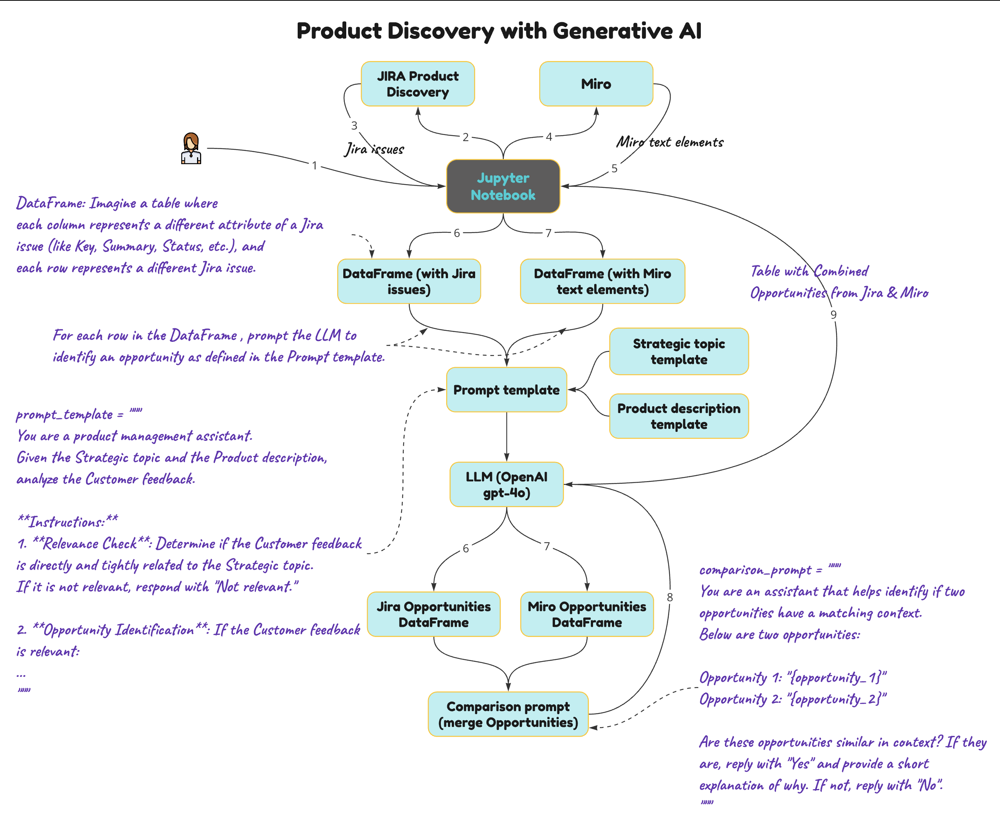

# ProductMuse
Product Discovery exploration where data from Jira and Miro are processed in a Jupyter Notebook, transformed into DataFrames (using pandas), and analysed by an LLM (OpenAI GPT-4) to identify product opportunities based on a product discovery template.

If you have any questions or would like to collaborate, feel free to reach out to me on [LinkedIn](https://www.linkedin.com/in/jenya-stoeva-60477249/). You're more than welcome!

## Context

The Jupyter Notebook facilitates Product Discovery exploration by integrating data from tools like Jira and Miro. It follows these steps:

1. <b>Data Collection:</b> Connects to Jira and Miro and extracts relevant data, such as issue summaries, descriptions, and user comments, to gather insights into ongoing projects challenges and customer feedback.
2. <b>Data Transformation:</b> The collected information is organized into structured formats (DataFrames) to enable easy analysis, leveraging tools like pandas.
3. <b>Integration with Large Language Models (LLMs):</b> Uses an LLM (OpenAI GPT-4) to evaluate and analyze the data, aiming to identify key product opportunities. The process is guided by a product discovery template that references two additional templates: a strategy template and a product description template. This approach provides flexibility in defining your product discovery prompts, ensuring that each Jira issue or Miro text is evaluated in the context of your strategic goals and product details. Feel free to adjust the templates to make them more focused or adapt them as needed for your context.
4. <b>Opportunity Identification:</b> The Notebook helps uncover product opportunities by systematically analyzing the data, enabling better decision-making for product roadmaps and prioritization.



## Intallation

<b>Prerequisites</b>

* Access to <b>JupyterLab, Google Colab</b>, or another interactive computing environment to run this Jupyter Notebook.
* <b>Access to a Large Language Model API</b> for evaluating your product discovery prompts.
* <b>API access to Jira, Miro</b>, or another tool that stores data for product discovery.

### Step 1: Clone the Repository

Clone this repository to your local machine:
```
git clone <REPOSITORY_URL>
cd <PROJECT_FOLDER>
```

### Step 2: Open Jupyter Notebook in JupyterLab

Ensure that ```<PROJECT_FOLDER>``` is accessible in JupyterLab by setting it as your working directory in JupyterLab.
 * In JupyterLab, use the "Open from Path" option to load ```ProductMuse_v1.ipynb```.
 * Similarly, load ```oneConnection.env``` and populate the variable keys with appropriate values.

### Step 3: Run the Jupyter Notebook

To execute the notebook, select each cell and press ```Shift + Enter```.
