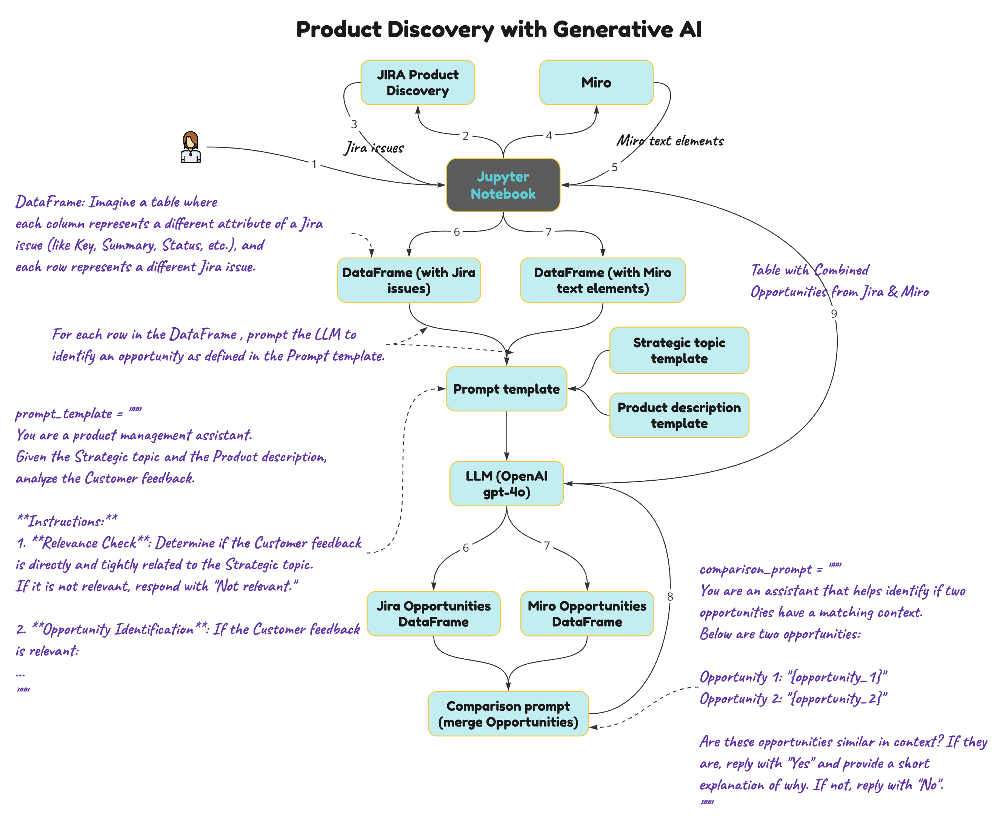

# ProductMuse
Product Discovery exploration where data from Jira and Miro are processed in a Jupyter Notebook, transformed into DataFrames (using pandas), and analysed by an LLM (OpenAI GPT-4) to identify product opportunities based on the data and a product discovery template.

